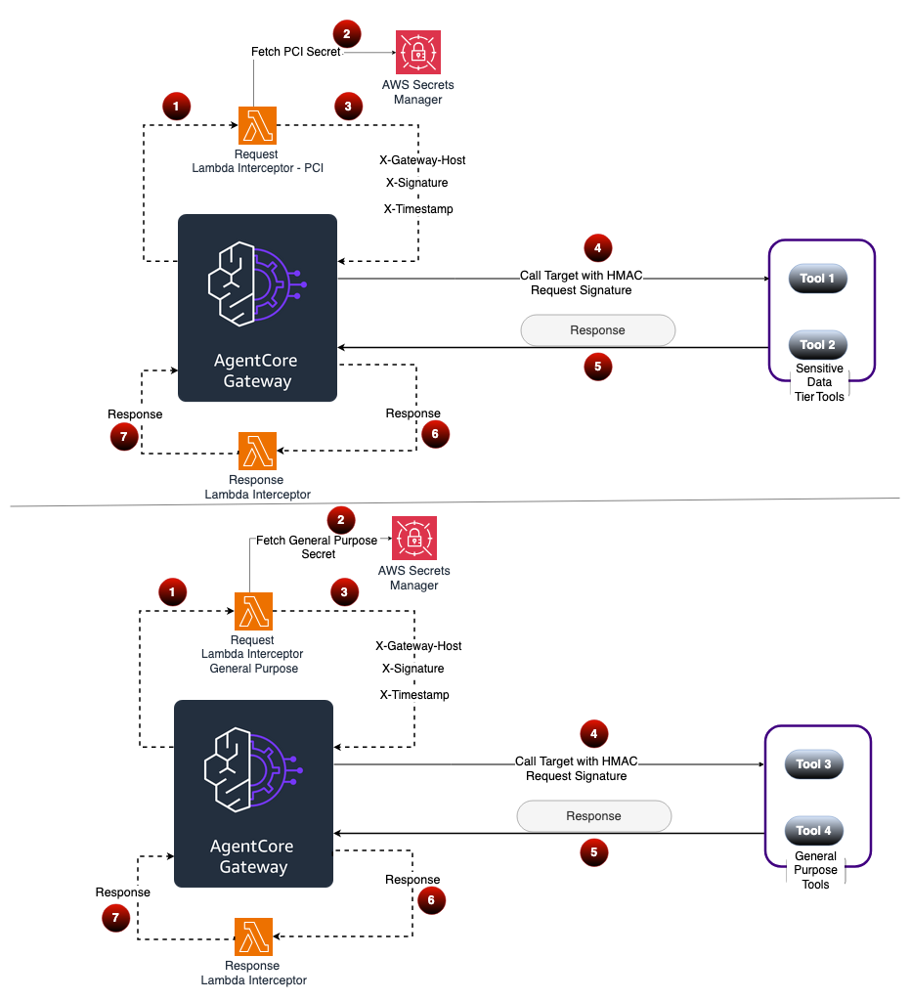

# Custom Authentication with Request Lambda Interceptor

## Introduction

When deploying AI agents with Amazon Bedrock AgentCore, organizations often need to integrate with enterprise APIs that use authentication methods not natively supported by the Gateway. The Gateway provides native support for OAuth 2.0, AWS IAM, and API key authentication — but many enterprise APIs still rely on other mechanisms such as HTTP Basic Authentication and HMAC-based request signing.

The **Request Lambda Interceptor** enables you to run custom authentication logic before the gateway forwards requests to your downstream tool APIs. This tutorial demonstrates two authentication patterns implemented in a single interceptor Lambda:

1. **JWT-to-Basic-Auth credential translation** — Decodes the inbound JWT to extract user identity, looks up per-user credentials in AWS Secrets Manager, and replaces the Bearer token with a Basic Auth header.

2. **HMAC-SHA256 request signing** — Generates a time-limited HMAC signature over the request metadata. The downstream tool validates the signature and rejects replayed or tampered requests.

Both patterns run through the same gateway — the interceptor routes to the correct handler based on the tool name in the MCP request body.


### How the Interceptor Works

When a request flows through the gateway, the interceptor Lambda receives the full MCP request envelope — headers, body, and tool name. It inspects the tool name from `body.params.name` and routes to the appropriate authentication handler:

```
Agent (Bearer token) → Gateway (validates JWT) → Interceptor Lambda → Target Tool API
                                                       ↓
                                                 Secrets Manager
                                            (credentials + HMAC secret)
```

- **Basic Auth tools** — The interceptor decodes the JWT to find the user's email, looks up their credentials in Secrets Manager, and replaces the `Authorization` header with Basic Auth.
- **HMAC tools** — The interceptor retrieves the shared secret from Secrets Manager, generates an HMAC-SHA256 signature over the request metadata, and injects `X-Signature`, `X-Timestamp`, and `X-Gateway-Host` headers.

### Multi-Gateway Architecture

In environments with multiple gateways serving different data classification levels, each gateway can be provisioned with a distinct HMAC secret. The downstream tool verifies which gateway issued the request by validating the signature against the expected secret for that gateway.



### Tutorial Details

| Information | Details |
|:---------------------|:-------------------------------------------------------------|
| Tutorial type | Interactive |
| AgentCore components | AgentCore Gateway |
| Gateway Target type | AWS Lambda |
| Inbound Auth IdP | Amazon Cognito (can be adapted to work with OIDC providers) |
| Outbound Auth | API Key (placeholder) + Request Lambda Interceptor |
| Tutorial components | Gateway, Interceptor, Two Tool APIs, Secrets Manager |
| Tutorial vertical | Cross-vertical |
| Example complexity | Intermediate |
| SDK used | boto3 |

### Key Features

* **Tool-aware routing** — Single interceptor handles multiple authentication patterns based on tool name
* **JWT-to-Basic-Auth translation** — Maps JWT identity to per-user credentials stored in Secrets Manager
* **HMAC-SHA256 signing** — Time-limited signatures with replay protection (300-second drift window)
* **Defense-in-depth** — Lambda resource policies restrict invocation to the gateway; Secrets Manager resource policies restrict access to the interceptor
* **Per-user credential isolation** — Each user's credentials are stored as a separate secret, following the convention `<prefix>/<user-pool-id>/<user-email>`
* **Gateway host verification** — HMAC signatures include the gateway host, enabling multi-gateway environments with distinct secrets per data classification level

## Tutorial

- [Custom Authentication with Request Lambda Interceptor](custom-auth-interceptor.ipynb)

## Resources

* [Gateway Request Interceptor — AWS Documentation](https://docs.aws.amazon.com/bedrock-agentcore/latest/devguide/gateway-interceptors.html)
* [AWS Secrets Manager — Developer Guide](https://docs.aws.amazon.com/secretsmanager/latest/userguide/intro.html)
* [Header Propagation with Gateway — AWS Documentation](https://docs.aws.amazon.com/bedrock-agentcore/latest/devguide/gateway-headers.html)

## Conclusion

This tutorial demonstrated how a single Request Lambda Interceptor can implement multiple custom authentication patterns — JWT-to-Basic-Auth credential translation and HMAC-SHA256 request signing — without modifying the agent or the downstream tool. The interceptor routes requests by tool name, retrieves secrets at runtime from Secrets Manager, and transforms authentication headers before the gateway forwards the request. To extend this pattern, add new handler functions for additional authentication schemes (OAuth 2.0 client credentials, mTLS, custom token formats) and update the routing logic in the interceptor's `lambda_handler`.

## Security

See [CONTRIBUTING](CONTRIBUTING.md#security-issue-notifications) for more information.

## License

This library is licensed under the MIT-0 License. See the LICENSE file.

