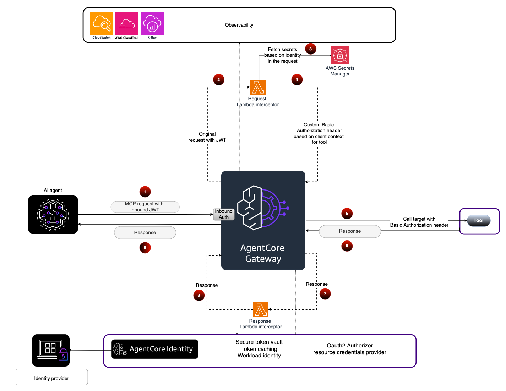

# Custom Authentication with Request Lambda Interceptor

## Introduction

When deploying AI agents with [Amazon Bedrock AgentCore](https://aws.amazon.com/bedrock/agentcore/), organizations benefit from built-in support for OAuth 2.0, [AWS Identity and Access Management (IAM)](https://aws.amazon.com/iam/), and API key authentication through [Amazon Bedrock AgentCore Gateway](https://aws.amazon.com/blogs/machine-learning/introducing-amazon-bedrock-agentcore-gateway-transforming-enterprise-ai-agent-tool-development/). Many enterprise environments also rely on additional authentication mechanisms such as HTTP Basic Authentication ([RFC 7617](https://datatracker.ietf.org/doc/html/rfc7617)). AgentCore Gateway's extensible architecture makes it straightforward to support these authentication mechanisms through [request Lambda interceptors](https://docs.aws.amazon.com/bedrock-agentcore/latest/devguide/gateway-interceptors.html) — custom code that runs each time an agent calls a tool.

This tutorial shows how to use a request Lambda interceptor to implement JWT-to-Basic-Auth credential translation — extracting user identity from an inbound OAuth token and dynamically resolving per-user Basic Auth credentials from [AWS Secrets Manager](https://aws.amazon.com/secrets-manager/) before forwarding the request to your downstream tool API.

**Important**: HTTP Basic Authentication transmits credentials as Base64-encoded text and should not be used as a long-term authentication strategy. AWS recommends modernizing to OAuth 2.0, SAML, or OpenID Connect where possible. However, some organizations choose to decouple authentication modernization from their agentic AI adoption, addressing each on independent timelines. If your environment requires Basic Auth integration as an interim measure, consult your AWS Solutions Architect to evaluate the security trade-offs before proceeding.



### How the Interceptor Works

When a request flows through the gateway, the interceptor Lambda receives the full MCP request envelope — headers, body, and tool name. It extracts the user identity from the inbound JWT claims, retrieves per-user credentials from Secrets Manager, and replaces the `Authorization` header with Basic Auth:

```
Agent (Bearer token) → Gateway (validates JWT) → Interceptor Lambda → Target Tool API
                                                       ↓
                                                 Secrets Manager
                                              (per-user credentials)
```

### Tutorial Details

| Information | Details |
|:---------------------|:-------------------------------------------------------------|
| Tutorial type | Interactive |
| AgentCore components | AgentCore Gateway |
| Gateway Target type | AWS Lambda |
| Inbound Auth IdP | Amazon Cognito (can be adapted to work with OIDC providers) |
| Outbound Auth | API Key (placeholder) + Request Lambda Interceptor |
| Tutorial components | Gateway, Interceptor, Tool API, Secrets Manager |
| Tutorial vertical | Cross-vertical |
| Example complexity | Intermediate |
| SDK used | boto3 |

### Key Features

* **JWT-to-Basic-Auth translation** — Maps JWT identity to per-user credentials stored in Secrets Manager
* **Defense-in-depth** — Lambda resource policies restrict invocation to the gateway; Secrets Manager resource policies restrict access to the interceptor
* **Per-user credential isolation** — Each user's credentials are stored as a separate secret, following the convention `<prefix>/<user-pool-id>/<user-email>`

## Tutorial

- [Custom Authentication with Request Lambda Interceptor](custom-auth-interceptor.ipynb)

## Resources

* [Gateway Request Interceptor — AWS Documentation](https://docs.aws.amazon.com/bedrock-agentcore/latest/devguide/gateway-interceptors.html)
* [AWS Secrets Manager — Developer Guide](https://docs.aws.amazon.com/secretsmanager/latest/userguide/intro.html)
* [Header Propagation with Gateway — AWS Documentation](https://docs.aws.amazon.com/bedrock-agentcore/latest/devguide/gateway-headers.html)

## Conclusion

You can use a request Lambda interceptor in AgentCore Gateway to bridge the gap between the authentication patterns supported by Gateway and the authentication requirements of enterprise tool APIs. As demonstrated in this tutorial, a request Lambda interceptor translates OAuth tokens to Basic Auth credentials through dynamic Secrets Manager lookups — without modifying tool schemas or agent implementation.

This approach has two advantages. First, authentication flexibility: the interceptor transforms requests to match your downstream tool's expectations while keeping the MCP tool interface unchanged. Second, security through externalized secrets management: credentials are retrieved at runtime from Secrets Manager with fine-grained IAM permissions, eliminating hardcoded secrets and enabling centralized credential rotation without code changes. For enterprises deploying AI agents that integrate with legacy backend systems, the interceptor pattern transforms authentication complexity from a barrier into a centralized, manageable capability — keeping tool schemas focused on business logic and providing a seamless experience where agents never need to understand the underlying authentication complexity of each enterprise API.
